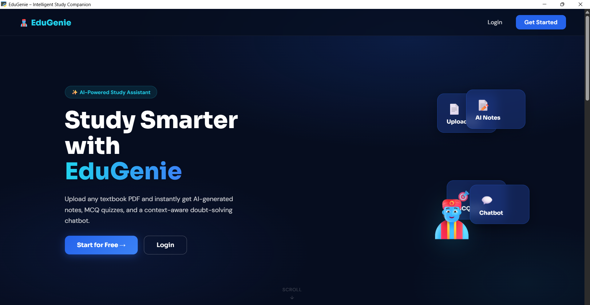
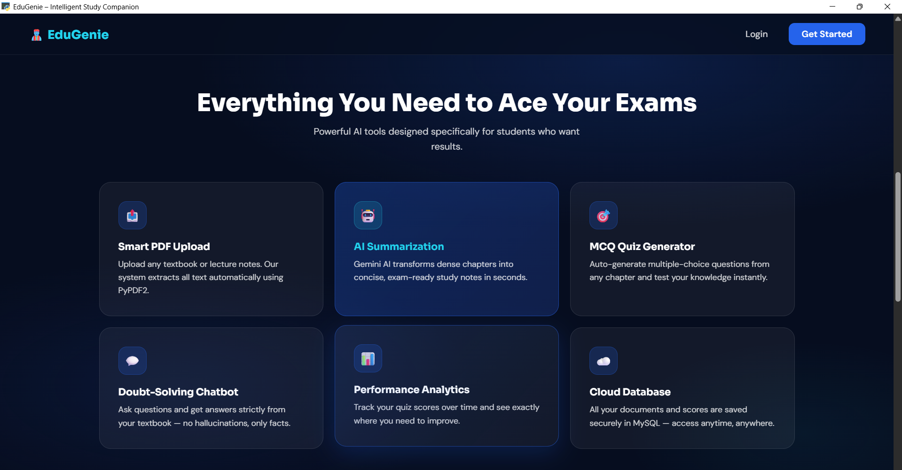
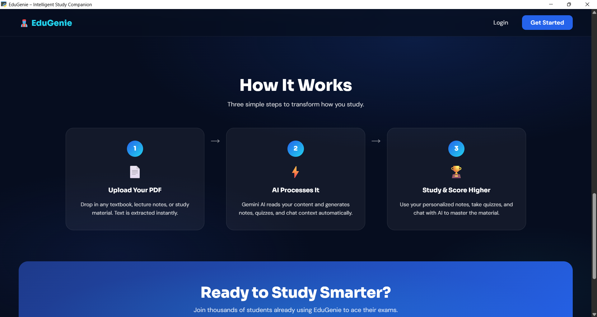
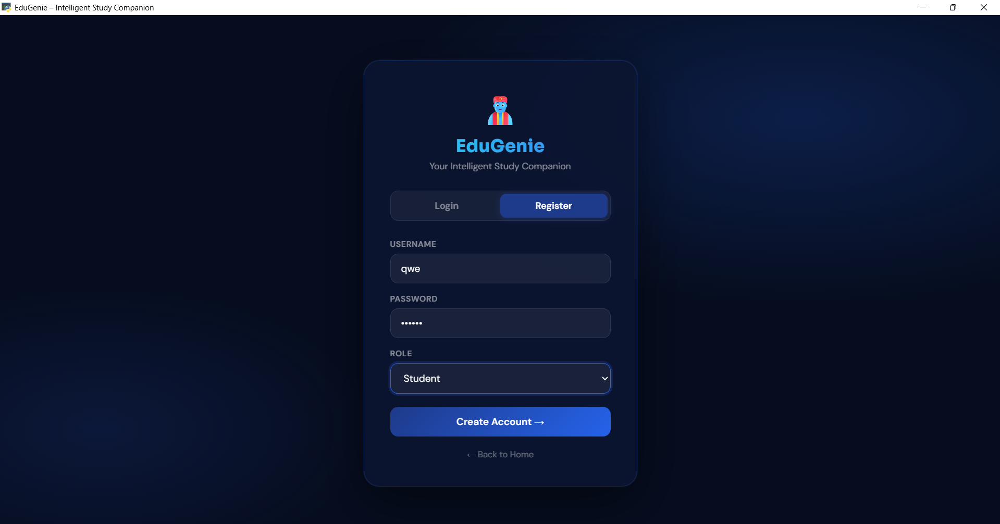
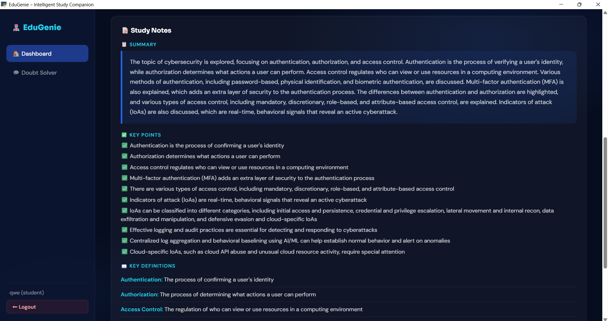

# 🧞 EduGenie — AI Study Companion


> An AI-powered web application that transforms any textbook PDF into an intelligent, interactive study experience — with summaries, MCQ quizzes, and a hallucination-free chatbot.


---

## 📸 Screenshots

### 🏠 Home Page


### ✨ Features Overview


### 🔄 How It Works


### 🔐 Register / Login


### 📚 AI Study Notes


---

## ✨ Features

| Feature | Description |
|---|---|
| 📄 **PDF Upload** | Upload any textbook PDF and extract text instantly |
| 🧠 **AI Summarization** | Get concise, context-aware summaries of your study material |
| ❓ **MCQ Quiz Generator** | Auto-generate multiple choice questions for self-assessment |
| 🤖 **Chatbot Doubt Solver** | Ask questions — answered strictly from your document (no hallucinations) |
| 📊 **Progress Analytics** | Track quiz scores and performance trends on your dashboard |
| 🔐 **Secure Auth** | Register & login with bcrypt-hashed passwords and Flask session management |

---

## 🛠️ Tech Stack

- **Backend:** Python, Flask
- **AI Engine:** Groq API (LLaMA 3.3 70B Versatile)
- **PDF Parsing:** PyPDF2
- **Database:** MySQL (hosted on Aiven Cloud)
- **Frontend:** HTML, CSS, JavaScript
- **Auth:** bcrypt, Flask sessions
- **Deployment:** PythonAnywhere

---

## 🚀 Getting Started (Run Locally)

### 1. Clone the repository
```bash
git clone https://github.com/Amruta-Dabholkar/EduGenie.git
cd EduGenie
```

### 2. Install dependencies
```bash
pip install -r requirements.txt
```

### 3. Set up environment variables

Create a `.env` file in the root directory:
```env
GROQ_API_KEY=your_groq_api_key_here

DB_HOST=your_mysql_host
DB_PORT=your_port
DB_NAME=your_db_name
DB_USER=your_username
DB_PASSWORD=your_password
DB_SSL=true

SECRET_KEY=your_flask_secret_key
FLASK_ENV=development
```

> Get your free Groq API key at [console.groq.com](https://console.groq.com)

### 4. Set up the database
```bash
mysql -u your_user -p your_db < schema.sql
```

### 5. Run the app
```bash
python app.py
```

Visit `http://localhost:5000` in your browser.

---

## 📁 Project Structure

```
EduGenie/
├── engine/
│   ├── ai_bot.py        # Groq API integration (summarization, MCQ, chatbot)
│   ├── db.py            # MySQL database connection & queries
│   ├── pdf_parser.py    # PDF text extraction using PyPDF2
│   └── __init__.py
├── static/
│   ├── css/             # Stylesheets
│   └── js/              # Frontend scripts
├── templates/           # HTML templates (Jinja2)
├── screenshots/         # App screenshots for README
├── uploads/             # Temporary PDF storage (gitignored)
├── app.py               # Main Flask application
├── schema.sql           # Database schema
├── requirements.txt     # Python dependencies
└── .env                 # Environment variables (gitignored)
```

---

## 🔒 Security

- All API keys and database credentials stored in `.env` (never committed)
- Passwords hashed using `bcrypt`
- User sessions managed securely via Flask

---

## 👩‍💻 About the Developer

**Amruta Anand Dabholkar**
B.E. Computer Engineering — YBIT, Sawantwadi (CGPA 8.50)

[](https://linkedin.com/in/amruta-dabholkar)
[](https://github.com/Amruta-Dabholkar)

---

## 📄 License

This project is licensed under the MIT License.

---

⭐ If you found this useful, please star the repo!
